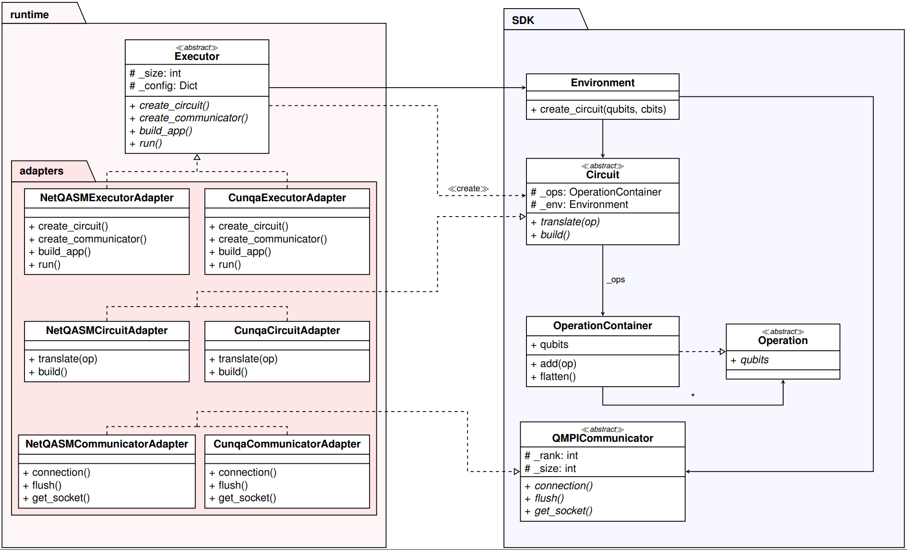

<p align="center">
  <picture>
    <source media="(prefers-color-scheme: dark)" srcset="https://raw.githubusercontent.com/NetQIR/netqmpi/refs/heads/main/logo-light.svg">
    <source media="(prefers-color-scheme: light)" srcset="https://raw.githubusercontent.com/NetQIR/netqmpi/refs/heads/main/logo-dark.svg">
    
  </picture>
</p>

**NetQMPI** is a Python library that brings the classical **MPI** (Message Passing
Interface) programming model to **Distributed Quantum Computing (DQC)**. Following
a Single-Program, Multiple-Data (SPMD) paradigm, the developer writes a single
script that runs across *N* quantum nodes and coordinates them through
message-passing primitives — including quantum-aware ones such as `qsend`,
`qrecv` and quantum collectives — without manually orchestrating low-level
entanglement, teleportation or classical messaging.

Crucially, NetQMPI is now **backend-agnostic**: the same, unmodified application
runs on several execution engines (a quantum-network simulator, an HPC emulator,
a circuit simulator, …) simply by selecting a backend on the command line.

## Table of Contents

- [Architecture: a decoupled design](#architecture-a-decoupled-design)
- [Available backends](#available-backends)
- [Installation](#installation)
- [Quick start](#quick-start)
- [Backend hardware configuration (`--config`)](#backend-hardware-configuration---config)
- [Writing a new backend](#writing-a-new-backend)
- [Examples](#examples)
- [Cite this work](#cite-this-work)

## Architecture: a decoupled design

Earlier versions of NetQMPI were implemented directly on top of the NetQASM SDK,
which tied programs to a single execution stack. NetQMPI has since been
restructured into a **decoupled architecture** that strictly separates *what* a
distributed quantum program does from *how* and *where* it runs
(see [Vázquez-Pérez *et al.*](#cite-this-work)):



- **SDK (user-facing).** Backend-agnostic abstractions: `Environment` (the local
  node context and a factory for circuits), `Circuit` (a fluent gate + `qsend`/
  `qrecv` API that records operations into an `OperationContainer`), and the
  `QMPICommunicator` (rank/size and communication primitives). Application code
  depends **only** on these.
- **Runtime (execution-facing).** Selects and drives a concrete backend through
  the **Adapter pattern + dependency injection**: an `Executor` bootstraps the
  processes and injects a backend-specific communicator into the `Environment`; a
  `CircuitAdapter` translates the recorded operations into native backend
  instructions; a concrete `Communicator` maps ranks and communication onto the
  platform's resources.

Because the boundary between the two layers is strict, **the same `app.py` runs
on any backend by switching a flag** — no changes to application logic.

## Available backends

| Backend | CLI flag | What it targets | Key dependencies |
|---|---|---|---|
| **NetQASM / SquidASM** | `--netqasm` | Low-level quantum-network simulation (EPR sockets, NetQASM routines) | [`squidasm`](https://github.com/QuTech-Delft/squidasm), [`netsquid`](https://netsquid.org), `netqasm` **1.x** |
| **CUNQA** | `--cunqa` | HPC emulation of DQC through virtual QPUs (vQPUs) | [`cunqa`](https://arxiv.org/abs/2511.05209) (HPC / Slurm environment) |
| **Qiskit Aer** | `--aer` | Shot-based circuit simulation (swap- or teleportation-based transfer) | `qiskit`, `qiskit-aer` |
| **Qoala** | `--qoala` | Quantum-internet **node execution environment** with task scheduling & multitasking — **simulation only** | [`qoala`](https://github.com/QuTech-Delft/qoala-sim), [`netsquid`](https://netsquid.org), `netqasm` **2.x**, Python 3.10–3.12 |

> **NetSquid account.** The NetQASM and Qoala backends depend on
> [NetSquid](https://netsquid.org), which requires a (free) account and is
> installed from its private index:
> `pip install netsquid --extra-index-url https://<user>:<pwd>@pypi.netsquid.org`.
>
> **NetQASM 1.x vs 2.x.** The NetQASM/SquidASM backend uses `netqasm` **1.x**,
> while Qoala uses `netqasm` **2.x**. These are mutually incompatible, so the
> `--netqasm` and `--qoala` backends must live in **separate environments**
> (e.g. two conda envs). CUNQA and Aer have no such constraint.
>
> **Qoala is simulation-only.** It models the software/hardware architecture of a
> quantum-internet node on NetSquid; it is not a path to real-hardware execution.

## Installation

Install the core package with pip:

```bash
pip install netqmpi
```

Then install the backend(s) you intend to use. Each backend lives behind a lazy
import, so you only need the dependencies of the backend you actually run.

<details>
<summary><b>NetQASM / SquidASM backend</b></summary>

```bash
pip install squidasm --extra-index-url https://<user>:<pwd>@pypi.netsquid.org
# pulls in netsquid and netqasm 1.x
```
See the [NetQASM installation docs](https://netqasm.readthedocs.io/en/stable/installation.html).
</details>

<details>
<summary><b>Qoala backend (separate environment, simulation only)</b></summary>

```bash
conda create -n qoala python=3.11 -y
conda activate qoala
pip install netsquid --extra-index-url https://<user>:<pwd>@pypi.netsquid.org
pip install qoala   --extra-index-url https://<user>:<pwd>@pypi.netsquid.org  # netqasm 2.x
pip install netqmpi
```
</details>

<details>
<summary><b>CUNQA backend (HPC)</b></summary>

Install and configure [CUNQA](https://arxiv.org/abs/2511.05209) on your HPC
cluster (it provisions vQPUs via the job scheduler), then install `netqmpi` in
the same environment.
</details>

<details>
<summary><b>Qiskit Aer backend</b></summary>

```bash
pip install qiskit qiskit-aer
```
</details>

## Quick start

NetQMPI is launched with an MPI-like command that selects the number of nodes and
the backend:

```bash
netqmpi -n <NUM_NODES> app.py --netqasm            # quantum-network simulation
netqmpi -n <NUM_NODES> app.py --cunqa --shots 1024 # HPC vQPU emulation
netqmpi -n <NUM_NODES> app.py --aer   --shots 1024 # circuit simulation
netqmpi -n <NUM_NODES> app.py --qoala --shots 100  # Qoala node exec. environment
```

The example below (`examples/netqmpi/send_recv.py`) prepares a qubit in
superposition on one node and teleports it to a neighbour with `qsend`/`qrecv`.
It uses **only** SDK abstractions, so the very same file runs on every backend:

```python
from netqmpi.sdk.environment import Environment

def main(env: Environment = None):
    comm = env.comm
    rank = comm.rank

    next_rank = comm.get_next_rank(rank)
    previous_rank = comm.get_prev_rank(rank)

    with comm:  # everything inside this block is executed on the backend
        if rank == 0:
            circuit = env.create_circuit(num_qubits=1, num_clbits=1)
            circuit.h(0)                          # prepare |+>
            comm.qsend(circuit, [0], next_rank)   # teleport the qubit
        else:
            circuit = env.create_circuit(num_qubits=1, num_clbits=1)
            comm.qrecv(circuit, [0], previous_rank)
            circuit.measure(0, 0)

    results = comm.results

    if rank != 0:
        print(f"measure: {results}")
    else:
        print("teleportation complete")
```

```bash
netqmpi -n 2 examples/netqmpi/send_recv.py --netqasm
netqmpi -n 2 examples/netqmpi/send_recv.py --qoala --shots 100
```

The programmer only invokes `comm.qsend()` / `comm.qrecv()`; entanglement
generation, teleportation and classical corrections are handled by the selected
backend adapter.

### Moving qubits collectively: `qscatter` / `qgather`

`qscatter` and `qgather` are `MPI_Scatter` and `MPI_Gather` with qubits instead
of bytes. Both are **collective** — every rank of the communicator must call
them — and **rooted**: the root passes the whole buffer, split into one chunk per
rank in rank order, and every other rank passes its own chunk. The call returns
the local qubits holding this rank's share.

Since a quantum state cannot be copied, the chunks are *moved*: each one is
teleported with the same `qsend`/`qrecv` machinery as above, so the sending side
does **not** keep the data. After a `qscatter` the root holds only its own chunk
and the slots it scattered are back in `|0>`; after a `qgather` the contributors
are left with `|0>` and the data lives on the root alone. The qubits a chunk
lands on must be in `|0>` when the call is reached, exactly as for a plain
`qrecv`.

```python
with comm:
    if rank == ROOT:
        # One qubit per rank: rank r gets qubit r, the root keeps its own.
        circuit = env.create_circuit(num_qubits=size, num_clbits=size)
        for q in range(size):
            circuit.x(q)
        mine = comm.qscatter(circuit, list(range(size)), root=ROOT)
        circuit.measure_all()
    else:
        circuit = env.create_circuit(num_qubits=1, num_clbits=1)
        mine = comm.qscatter(circuit, [0], root=ROOT)   # lands on qubit 0
        circuit.measure(mine[0], 0)
```

Each transfer borrows one communication qubit and two protocol classical bits and
gives them straight back, so a whole scatter costs the same resources as a single
`qsend`. `examples/netqmpi/scatter.py` and `examples/netqmpi/gather.py` run the
two collectives end to end.

### Sharing a control qubit: `expose` / `unexpose`

Moving a qubit is not always what a distributed algorithm needs. When several
ranks only want to apply gates *controlled* by a remote qubit — the crossing
rotations of a QFT, for instance — the qubit can stay where it is and be lent to
them instead, through a shared GHZ state (*telegate*).

`expose` and `unexpose` are **collective**, like an `MPI_Bcast`: every rank of
the window must call them, and `root` names the rank lending the qubit. The call
returns the index each rank must use as control — its own data qubit on the root,
a freshly reserved communication qubit on every receiver — so the gate itself is
written exactly like a local one:

```python
with comm:
    circuit = env.create_circuit(num_qubits=1, num_clbits=1)

    # Rank 1 lends its qubit 0 to rank 0, which drives a CS with it.
    control = comm.expose(circuit, 0, [0], root=1)

    if rank == 0:
        circuit.h(0)
        circuit.cs(control, 0)

    comm.unexpose(circuit, [0], root=1)   # the control goes back untouched
```

Communication qubits and the classical bits carrying the protocol corrections are
reserved when a window opens and released when it closes, so windows that do not
overlap reuse the same resources and user classical bits are never clobbered.
`examples/netqmpi/qft_expose.py` builds a full 3-rank QFT this way.

## Backend hardware configuration (`--config`)

Backend-specific parameters are passed through a single YAML file with `--config`
(instead of a proliferation of per-backend flags). The file has generic settings
at the top level plus an optional block named after the backend; only the block
for the selected backend is read. For example, configuring the Qoala qdevice and
its entanglement link:

```yaml
# config.yaml
shots: 1000
seed: 7
qoala:
  link_fidelity: 0.8          # EPR-pair fidelity in [0.25, 1.0]
  hardware:                   # qdevice noise model (omit for a perfect device)
    t1: 0
    t2: 0
    single_qubit_gate_depolar_prob: 0.1
    two_qubit_gate_depolar_prob: 0.0
```

```bash
netqmpi -n 2 app.py --qoala --config config.yaml
```

## Writing a new backend

Adding a backend **never requires touching the SDK**. Following the architecture
above, you provide three Runtime components under
`netqmpi/runtime/adapters/<backend>/` (mirroring the existing `netqasm/`,
`cunqa/`, `aer/`, `qoala/` packages):

1. **`Executor`** (subclass of `netqmpi.runtime.executor.Executor`) — bootstraps
   the execution environment, discovers resources, and injects a backend-specific
   communicator into each node's `Environment` (`build_apps` + `run`).
2. **`CircuitAdapter`** (subclass of `netqmpi.sdk.circuit.Circuit`) — implements
   the `_translate_*` hooks that map the abstract operations recorded in the
   `OperationContainer` (local gates, `measure`, `qsend`/`qrecv`, …) to the
   backend's native instructions. Operations deriving from `CollectiveOperation`
   (`expose`/`unexpose`) are the exception: if the backend expands them into all
   the participating circuits at once, as CUNQA's cat-entangler does, the adapter
   translates the ranks jointly, stopping each of them at the matching collective
   (see `translate_group` in the CUNQA adapter).
3. **`QMPICommunicator`** (subclass of the abstract communicator) — maps rank /
   size and the communication primitives onto the backend's real resources, and
   triggers execution on context exit.

Finally, register a `--<backend>` flag in `netqmpi/runtime/cli.py` (with a lazy
import so users without that backend's dependencies are unaffected). The
integration workflow is identical for every backend; only the realization of
these three components differs.

## Examples

Ready-to-run scripts live in [`examples/netqmpi/`](examples/netqmpi):
`send_recv.py` (distributed superposition / teleportation), `scatter.py`,
`gather.py`, `roundrobin.py`, `qft_expose.py`.

Validation experiments for the Qoala backend (hardware-parameter propagation, EPR
fidelity sweep, and scheduling/multitasking) are documented in
[`scripts/experiments/`](scripts/experiments).

## Cite this work

If you use **NetQMPI** in your research, please cite the following works:

> ### NetQMPI: a practical MPI-inspired library for distributed quantum computing over NetQASM SDK
> **F. Javier Cardama**, **Tomás F. Pena**
> *Proceedings of the IEEE International Conference on Cluster Computing (IEEE Cluster 2025)*
> DOI: [10.1109/CLUSTERWorkshops65972.2025.11164201](https://doi.org/10.1109/CLUSTERWorkshops65972.2025.11164201)

---

> ### Emulating NetQMPI applications with CUNQA: A Decoupled Architecture for HPC Environments
> **Jorge Vázquez-Pérez**, **F. Javier Cardama**, **Tomás F. Pena**, **Andrés Gómez**
> *Proceedings of the IEEE International Conference on Distributed Computer Systems (ICDCS 2026).*
> PDF: [PDF Paper](papers/Emulating_NetQMPI_applications_with_CUNQA.pdf)

---

> ### NetQIR: An Extension of QIR for Distributed Quantum Computing
> **F. Javier Cardama**, **Jorge Vázquez-Pérez**, **C. Piñeiro**, **T. F. Pena**, **J. C. Pichel**, **Andrés Gómez**
> *Future Generation Computer Systems*, Vol. 174, 2026, Article 107989
> DOI: [10.1016/j.future.2025.107989](https://doi.org/10.1016/j.future.2025.107989)

---
