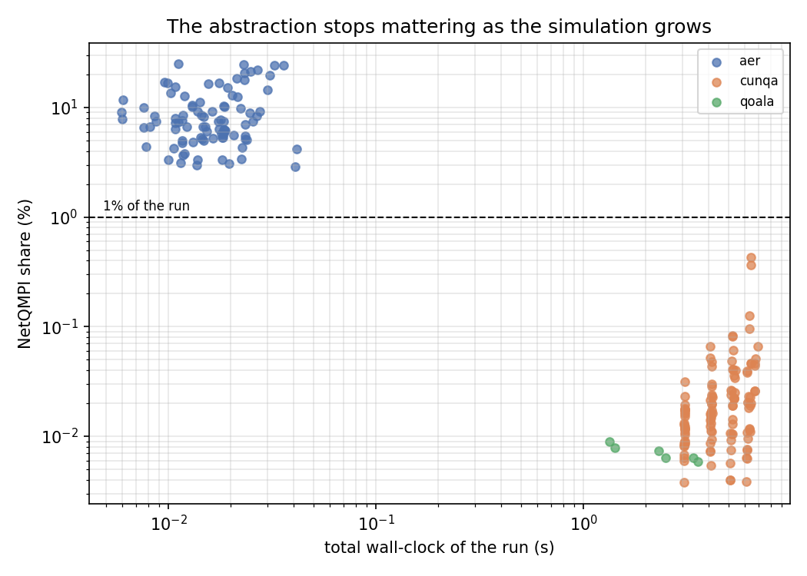
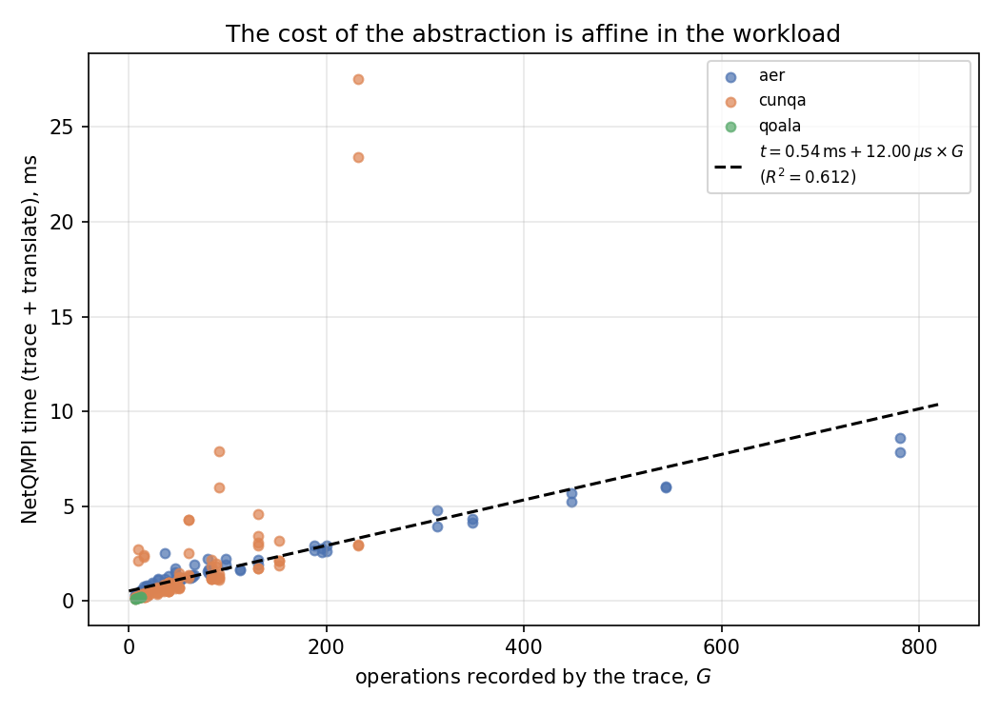
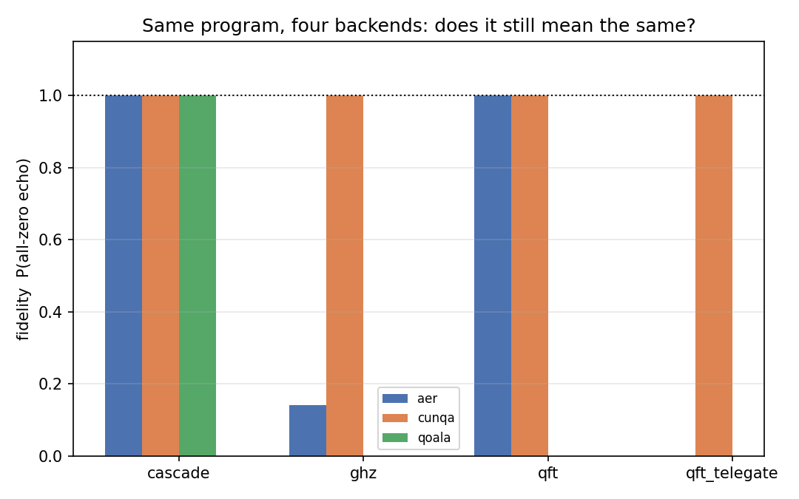

# Benchmark multi-backend de NetQMPI

> Requiere los **cuatro** entornos: `qiskit-1-3` (Aer), `qoala` (Qoala),
> `squidasm` (NetQASM) y la imagen Docker `netqmpi:cunqa` (CUNQA + Slurm).
> Ninguno puede compartir intérprete con otro: netqasm 1.x y 2.x son
> incompatibles, y CUNQA solo existe dentro de su contenedor.

## Objetivo

Dos preguntas, una por cada mitad de la promesa de NetQMPI.

1. **«Un código, varios backends»: ¿se cumple?** El mismo `app.py` sin tocar
   se ejecuta en los cuatro backends y se comprueba si sigue significando lo
   mismo: si termina, si el adaptador soporta las primitivas que usa, y si el
   resultado es el correcto. La respuesta es la **matriz de portabilidad**.

2. **¿Cuánto cuesta la abstracción?** Un programa distribuido pasa por cinco
   fases y solo dos son NetQMPI. Se mide cada una por separado, en tiempo y
   en memoria, y se ajusta un **modelo de coste** que permite extrapolar:
   dado un programa, ¿cuánto va a costar la capa NetQMPI y a partir de qué
   tamaño deja de importar?

No se busca novedad algorítmica. Se busca cuantificar, con números
reproducibles, algo que hasta ahora solo se afirmaba.

## Las cinco fases de una ejecución

| Fase | Qué es | ¿Es NetQMPI? |
|---|---|---|
| `import` | Importar el adaptador y el simulador que arrastra | no |
| `setup` | Construir el executor y `build_apps`: descubrimiento de recursos, `qraise` de vQPUs, construcción de topología | no |
| `trace` | Ejecutar el `main()` del usuario; el SDK graba operaciones en el `OperationContainer` | **sí — coste del SDK** |
| `translate` | `Circuit.translate`: convertir esas operaciones en instrucciones nativas | **sí — coste del adaptador** |
| `backend` | El backend ejecutando de verdad: enviar, simular, recoger | no |
| `sync` | Esperas en barrera entre ranks y fontanería de resultados | no |

`t_netqmpi = trace + translate` es el precio de la abstracción;
`setup + backend + sync` es el precio de la plataforma que hay debajo.

**Cómo se obtiene la separación.** `translate` se mide envolviendo
`netqmpi.sdk.circuit.Circuit.translate`, que es el embudo por el que pasan
todos los adaptadores, contando solo la llamada más externa para no cobrar
dos veces la recursión sobre el `OperationContainer`. `backend` se mide
envolviendo una llamada por backend (`profiler.BACKEND_PROBES`).

`trace` se mide **directamente**, no por resta, y esto importa más de lo que
parece. Todo lo que hace un backend —traducir, simular y sincronizar los
ranks— ocurre dentro del `__exit__` del comunicador, así que cronometrar el
`main()` de cada rank y descontarle el tiempo que pasó en ese `__exit__` deja
exactamente el grabado de operaciones. Tomar `trace` como «lo que sobra de
`executor.run()`» metería dentro las esperas en barrera de los backends que
ejecutan un hilo por rank, y esas esperas son latencia de concurrencia, no
coste de la abstracción: **en Aer llegaban a superar al trazado real en un
orden de magnitud** y variaban al azar entre ejecuciones. Lo que queda dentro
del `__exit__` tras quitar traducción y ejecución se reporta aparte como
`sync`.

En un backend que ejecuta sus ranks concurrentemente las cifras por rank se
suman, así que pueden sumar más que el reloj de pared; `total` es siempre el
tiempo transcurrido real.

## Los algoritmos

Cuatro sondas, elegidas para cubrir **patrones de comunicación distintos**,
no para cubrir dominios de aplicación distintos. Lo que cambia el coste de
un programa distribuido es su topología de comunicación y su volumen, no si
calcula una transformada o un estado de prueba.

| App | Patrón | Transferencias | Primitiva |
|---|---|---|---|
| [`cascade`](apps/cascade.py) | cadena punto a punto | `q · (size−1)` | `qsend`/`qrecv` |
| [`ghz`](apps/ghz.py) | estrella uno-a-muchos | `4 · (size−1)` | `qsend`/`qrecv` |
| [`qft`](apps/qft.py) | todos con todos | `2 · q · size · (size−1)` | `qsend`/`qrecv` |
| [`qft_telegate`](apps/qft_telegate.py) | todos con todos | `size − q` ventanas | `expose`/`unexpose` |

`qft` y `qft_telegate` calculan **la misma transformada** de dos maneras:
moviendo el control (*teledata*) o compartiéndolo (*telegate*). Ejecutar las
dos sobre el mismo backend es lo que aísla el coste de una estrategia frente
a la otra.

### Por qué todas son *echo*

Cada sonda aplica una transformación y luego la deshace, de modo que el
resultado sin ruido es **todo ceros en todos los ranks**. Es deliberado:

- Una expectativa de todo ceros **no depende del orden de bits** con que
  cada backend etiqueta su histograma, lo que elimina una clase entera de
  errores silenciosos de comparación.
- Es un criterio que **cada rank puede puntuar por separado**, y eso importa
  porque **CUNQA devuelve un histograma por rank — marginales, no la
  distribución conjunta**. De marginales no se puede reconstruir la
  probabilidad conjunta de éxito, así que la métrica portable es el producto
  de las probabilidades por rank. Donde el backend sí expone la conjunta
  (Aer guarda los bits clásicos de todos los ranks en un registro) se
  reporta también, y ambas coinciden si los errores por rank son
  independientes.
- Un QFT *sin* deshacer no serviría: aplicado a un estado base, su
  histograma en Z es uniforme haga lo que haga con las rotaciones, así que
  un backend que se comiera todas las rotaciones puntuaría 1.0. El eco es
  sensible a **cada** rotación.

Por eso el QFT usa `NQB_INPUT=0` por defecto. El eco es sensible a las
rotaciones sea cual sea la entrada, y con entrada 0 el criterio de éxito es
independiente del orden de bits. Con `NQB_INPUT=x` distinto de cero la
comprobación pasa a ser «cada rank lee su rodaja de x», útil como test de
corrección pero ya dependiente de la convención de cada backend.

## Métricas

**Tiempo.** Las cinco fases, por separado, en segundos de reloj de pared.
La primera repetición de cada proceso paga los imports y lo que cada
librería inicializa perezosamente; se reporta aparte como *cold start* en
lugar de mezclarse en el modelo.

**Memoria.** Dos cifras, porque ninguna es honesta por sí sola:

- `py_peak` — pico de `tracemalloc`, solo asignaciones de Python. Es lo que
  captura de verdad la huella de NetQMPI: los objetos `Operation` que
  construye el trazado. **No ve** un vector de estado en C++.
- `rss_peak` — pico de RSS del proceso entero (`getrusage`), que sí incluye
  la memoria del simulador — salvo en CUNQA, donde los vQPUs son procesos
  aparte y quedan fuera.

`tracemalloc` distorsiona mucho los tiempos, así que **nunca se miden a la
vez**: las repeticiones de tiempo van sin él y se añade una pasada de
memoria aparte.

**Fidelidad.** `P(todo ceros)` por rank, y su producto como métrica global.

## Modelo de coste

El trazado y la traducción deberían ser **afines** en el número de
operaciones grabadas: un precio fijo por entrar en la maquinaria más un
precio por operación. El modelo ajustado es

    t_netqmpi(G) = α + β · G

con `G` las operaciones que grabó el trazado, `α` en milisegundos y `β` en
microsegundos por operación. A la memoria de Python se le ajusta la misma
forma.

Tratar todas las operaciones como igual de caras es el primer modelo obvio y
uno malo: una puerta local se traduce en una instrucción nativa, mientras que
un `qsend` se expande en un protocolo de teleportación entero —entrelazamiento,
medida de Bell y sus correcciones—. Por eso se ajusta también un modelo con
dos regresores,

    t_netqmpi = α + β · G_local + γ · G_comm

donde el cociente `γ/β` es un número directamente útil: cuántas puertas
locales cuesta traducir un solo acto de comunicación.

Los ajustes se hacen sobre **una mediana por configuración**, no sobre cada
repetición: repetir más veces una configuración no debe inclinar la regresión,
y el jitter entre repeticiones no es lo que el modelo intenta explicar.

Como **α y β son constantes** mientras el coste de un simulador crece con la
anchura del registro, el modelo se puede resolver para el punto en que la
abstracción deja de importar: el **cruce** en que NetQMPI cae por debajo del
1% de la ejecución. El coste del backend se ajusta como exponencial en el
número total de qubits, `t_backend = a · exp(b · Q)`, regresando su
logaritmo — el comportamiento de vector de estado que hace que ese cruce
exista.

Todos los ajustes son mínimos cuadrados con `R²` reportado
([`analyze.py`](analyze.py)).

## Cómo ejecutar

```sh
# Rejilla completa en los cuatro backends (NetQASM es con diferencia el más lento)
./scripts/benchmark/run_all.sh

# Solo algunos backends, o una rejilla mínima de humo
BACKENDS="aer cunqa" ./scripts/benchmark/run_all.sh
./scripts/benchmark/run_all.sh --quick

# Una sola configuración
python scripts/benchmark/run_benchmark.py --backend aer --app qft \
    --ranks 4 --qubits 2 --shots 1024 --reps 3 --memory --out results/raw.jsonl

# Ajuste del modelo, tablas y gráficas
python scripts/benchmark/analyze.py
```

Cada configuración corre en **un proceso propio**: el pico de RSS es una
cifra monótona de proceso y el coste de importar un simulador solo se paga
una vez por proceso, así que compartir proceso entre configuraciones
emborronaría ambas cosas.

Ninguna ejecución se pierde. Un backend que no implementa una primitiva
queda registrado con `status="unsupported"` — eso *es* el dato del que sale
la matriz de portabilidad. Dos de los backends ejecutan sus ranks en hilos y
un fallo ahí deja al hilo principal esperando en una barrera para siempre,
por lo que cada ejecución lleva un *watchdog* armado que registra la causa
real antes de matar el proceso.

## Salidas

| Fichero | Qué es |
|---|---|
| `results/raw.jsonl` | Un registro por repetición, con todo lo medido |
| `results/report.md` | Tablas: portabilidad, overhead por backend, modelo |
| `results/model.json` | Coeficientes ajustados, por backend y agregados |
| `results/phase_breakdown.png` | Dónde se va el tiempo, por backend y app |
| `results/overhead_model.png` | Coste de NetQMPI frente a `G`, con el ajuste |
| `results/overhead_share.png` | Cuota de NetQMPI frente al total, con la línea del 1% |
| `results/memory_model.png` | Pico de memoria Python frente a `G` |
| `results/fidelity.png` | Fidelidad de cada app en cada backend |

---

# Resultados

Rejilla de esta ejecución: Aer 2–6 ranks × 1–3 qubits/rank (1024 shots),
CUNQA 2–7 ranks × 1–2 qubits/rank (1024 shots), Qoala 2–4 ranks (100 shots),
NetQASM 2–3 ranks (10 shots). 3 repeticiones de tiempo más una pasada de
memoria por configuración; **474 registros** en
[`results/raw.jsonl`](results/raw.jsonl). Tablas completas en
[`results/report.md`](results/report.md), coeficientes en
[`results/model.json`](results/model.json).

## 1. Matriz de portabilidad

| app | aer | cunqa | qoala | netqasm |
|---|---|---|---|---|
| `cascade` | OK | OK | OK | error |
| `ghz` | **WRONG** 0.10–1.00 | OK | n/i | – |
| `qft` | OK | OK | n/i | – |
| `qft_telegate` | n/i | OK | n/i | – |

`OK` = eco exacto en **todas** las configuraciones probadas. `n/i` = el
adaptador lanza `NotImplementedError`. `WRONG` = terminó pero devolvió la
respuesta equivocada en un backend **sin modelo de ruido**, donde cualquier
cosa por debajo de un eco perfecto es un fallo de traducción, no
decoherencia.

**El resultado principal es incómodo y hay que decirlo con claridad: hoy
«un código, varios backends» solo se cumple del todo en CUNQA.** El único
primitivo de comunicación que implementan los cuatro adaptadores es
`qsend`/`qrecv`. Lo que se encontró, backend por backend:

- **CUNQA** — ejecuta las cuatro sondas con F = 1.0000. Es el único que
  implementa `expose`/`unexpose`, y por tanto el único donde se puede
  comparar telegate contra teledata.
- **Aer** — dos limitaciones reales del adaptador, ninguna documentada:
  1. `_translate_qrecv` es un **no-op** y `_translate_qsend` intercambia el
     qubit al **mismo índice local** del rank destino, ignorando el índice
     que pide el receptor ([`aer_circuit.py:184`](../../netqmpi/runtime/adapters/aer/aer_circuit.py#L184)).
     Un programa donde emisor y receptor usan índices distintos significa
     cosas distintas según el backend. Las apps de este benchmark hacen
     viajar el control por una ranura *scratch* con el mismo índice en
     ambos lados para sortearlo.
  2. El adaptador traduce **rank por rank** en orden de rank
     ([`aer_communicator.py:108`](../../netqmpi/runtime/adapters/aer/aer_communicator.py#L108)),
     así que las dependencias entre ranks se pierden salvo que el programa
     resulte seguir ese mismo orden. `cascade` (cadena monótona) funciona
     por casualidad; `ghz` (estrella, el control vuelve a rank 0 entre
     saltos) **da resultados incorrectos en todas las configuraciones salvo
     la trivial**: acierta con 2 ranks × 1 qubit y a partir de ahí cae a
     F = 0.12–0.23, sin lanzar ningún error ni aviso. Es el hallazgo más
     serio del benchmark, porque **falla en silencio**: un usuario que
     desarrolle en Aer y despliegue en CUNQA obtiene dos respuestas
     distintas y nada le avisa de cuál es la buena.

     | | q=1 | q=2 | q=3 |
     |---|---|---|---|
     | **n=2** | 1.000 | 0.228 | 0.234 |
     | **n=3** | 0.235 | 0.124 | 0.121 |
     | **n=4** | 0.229 | 0.120 | — |
  3. `transfer_mode="teleport"` está documentado en la configuración pero
     lanza `NotImplementedError`; solo existe `"swap"`, que es no físico
     (sin EPR, sin ruido). Por eso Aer vale como **referencia de corrección**,
     no como medida de fidelidad.
- **Qoala** — solo `cascade`. Faltan `expose`/`unexpose`, `SWAP` y
  controlled-P. Además **`cx` y `cz` son inalcanzables**: el SDK emite
  `ControlledGate(control, Gate('X'))` pero el adaptador compara contra
  `"RX"`/`"RZ"` ([`qoala_circuit.py:313`](../../netqmpi/runtime/adapters/qoala/qoala_circuit.py#L313)),
  así que la única puerta de dos qubits que se puede usar hoy es la que
  nadie escribe a mano.
- **NetQASM/SquidASM** — **no arranca**. `program_inputs` se construye vacío
  en [`netqasm_communicator.py:129`](../../netqmpi/runtime/adapters/netqasm/netqasm_communicator.py#L129)
  y SquidASM hace `program_inputs[party]` para cada programa, así que
  `KeyError: 'rank_0'` para cualquier app. Parcheando esa línea, la
  ejecución avanza pero cae en `QubitNotActiveError: Qubit 3 is not active`,
  un segundo fallo más profundo en la gestión de qubits del adaptador. En
  ambos casos el proceso **no termina** tras el error (quedan hilos vivos);
  por eso el runner lleva watchdog.

## 2. Cuánto cuesta la abstracción

| backend | configs | total en frío | total en caliente | NetQMPI | cuota |
|---|---|---|---|---|---|
| aer | 45 | 0.326 s | 0.0165 s | 1.20 ms | **8.11%** |
| cunqa | 24 | 4.804 s | 4.6261 s | 0.64 ms | **0.02%** |
| qoala | 3 | 3.137 s | 2.3921 s | 0.16 ms | **0.01%** |

En términos absolutos NetQMPI cuesta **entre 0.16 y 1.2 ms** por ejecución.
Lo que cambia entre backends no es ese coste, sino contra qué se compara:
Aer termina en 16 ms, CUNQA y Qoala tardan segundos.



Los puntos se separan en dos regímenes a ambos lados de la línea del 1%.
Con Aer sobre circuitos diminutos la abstracción es el 3–25% del reloj;
en cuanto hay una simulación de verdad detrás (CUNQA, Qoala) cae a
**0.004–0.4%**. No hay ningún punto intermedio en esta rejilla: el cruce ya
ha ocurrido para cualquier carga no trivial.

El coste **en frío** es otra cosa y conviene no esconderlo: la primera
ejecución de un proceso paga 0.33 s en Aer (dominado por `import qiskit_aer`)
y 4.8 s en CUNQA (dominado por el `qraise`/SLURM que levanta los vQPUs). Eso
no es NetQMPI, pero es lo que paga quien ejecuta un programa una sola vez.

## 3. El modelo de coste



| backend | α (ms) | β (µs/op) | R² | configs |
|---|---|---|---|---|
| aer | 0.619 | 10.32 | **0.974** | 45 |
| cunqa | −0.720 | 40.43 | 0.714 | 24 |
| qoala | 0.018 | 16.12 | 1.000 † | 3 |
| pooled | 0.537 | 12.00 | 0.612 | 72 |

† 3 configuraciones contra 2 parámetros libres: los coeficientes son
indicativos, el R² no es evidencia.

El ajuste de Aer confirma la forma esperada con **R² = 0.974**: un coste fijo
de **0.62 ms** más **10.3 µs por operación**. El de CUNQA es más ruidoso
(R² = 0.71, α negativo, que es un artefacto del ajuste) por una razón
mecánica: se está midiendo una cantidad de ~0.6 ms dentro de una ejecución de
~4.6 s, es decir el 0.01%, al borde de la resolución y con el jitter de SLURM
y ZMQ encima.

Separando puertas locales de primitivas de comunicación:

| backend | α (ms) | β (µs/op local) | γ (µs/op comm) | γ/β | R² |
|---|---|---|---|---|---|
| aer | 0.614 | 6.57 | 14.57 | **2.2×** | 0.976 |
| pooled | 0.519 | 4.85 | 20.07 | 4.1× | 0.616 |

**Traducir un acto de comunicación cuesta 2.2 veces lo que una puerta local**
(Aer, R² = 0.976), que es exactamente lo que cabe esperar: un `qsend` no se
convierte en una instrucción sino en un protocolo de teleportación entero.
El ajuste de CUNQA para este modelo sale degenerado (γ negativo): sus dos
regresores están demasiado correlacionados en una rejilla de un solo qubit
por rank.

## 4. Fidelidad



CUNQA y Qoala devuelven el eco exacto (F = 1.0000) en todo lo que ejecutan.
Aer también, salvo `ghz`, donde el orden de traducción rank a rank rompe el
programa (§1). No hay aquí una comparación de *ruido* entre backends: Aer y
CUNQA simulan sin modelo de ruido en esta configuración, y Qoala solo llegó a
ejecutar una de las cuatro sondas. Medir degradación por decoherencia exige
activar los modelos de hardware de Qoala — que es justo lo que hacen los
[experimentos de Qoala](../experiments/README.md) ya existentes.

## Limitaciones

- **Fidelidad marginal, no conjunta.** CUNQA devuelve un histograma por
  rank. De marginales no se reconstruye la probabilidad conjunta de éxito,
  así que la métrica portable es el producto de las probabilidades por rank.
  Coinciden si los errores por rank son independientes; donde el backend
  expone la conjunta (Aer) se reporta también.
- **`rss_peak` no ve los vQPUs de CUNQA**, que son procesos aparte. Para ese
  backend la única cifra de memoria válida es `py_peak` (lado Python).
- **La rejilla de CUNQA se queda en 1 qubit/rank** en la mayoría de sondas:
  la definición de vQPU por defecto es estrecha y dos qubits de datos más la
  ranura scratch más los de comunicación ya la desbordan («Not enough data
  qubits in the QPU»). Ampliarla requiere un fichero de definición de vQPU
  como ajuste `backend`, que es propiedad del despliegue, no de NetQMPI.
- **CUNQA local no pasa de 5 ranks**: a partir de 6 el Slurm del contenedor
  responde `sbatch submission failed` con los recursos de una sola máquina.
  No es un límite de NetQMPI.
- **`translate` no se puede aislar en NetQASM**: su adaptador devuelve
  *callables* desde `translate` y los ejecuta dentro de la simulación, así
  que las dos fases están entrelazadas. El campo `translate_isolated` de cada
  registro lo indica.
- **Los tiempos por fase se suman por rank.** En un backend concurrente
  (Aer) pueden sumar más que el reloj de pared; `total` es siempre el tiempo
  transcurrido real.
- **Una sola máquina, un solo despliegue.** Estos números caracterizan *esta*
  instalación. La forma del modelo (α + β·G) debería trasladarse; los valores
  de α y β no.
